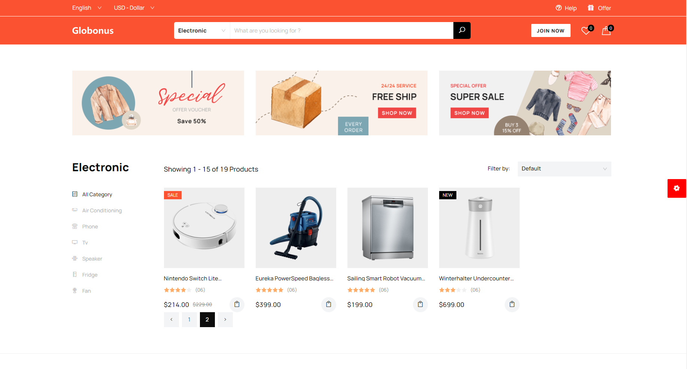
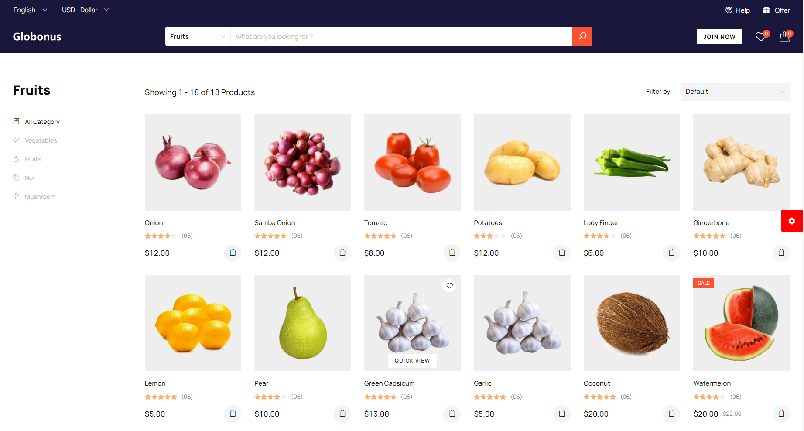
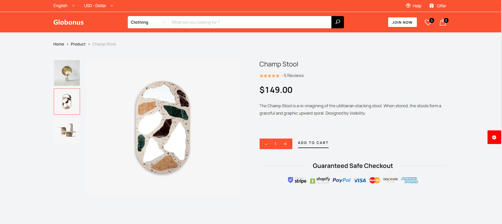

# e-commerce

We create top-notch demo websites because we analyze the market and anticipate the coming trend of this industry. This project is built with React, Redux, Bootstrap 4, W3C validate Code, and HTML 5 at a time. The best thing people will enjoy in your site is Cross-Browser Compatibility and Responsive layout altogether. On the other hand, the Eliah template has excellent product display with collection sorting and product review.

# work

React + Redux
W3C validate Code

## Getting Started

First, run the development server:

```bash
npm run dev
# or
yarn dev
```





